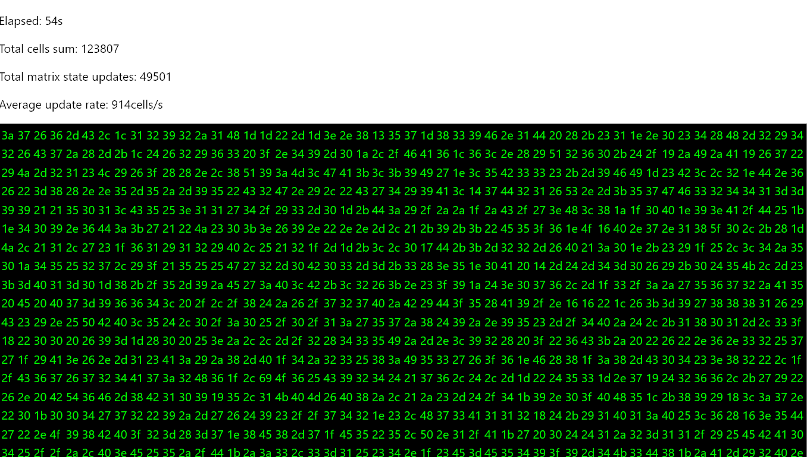

# Strict mode and performance application demo

Frequent state updates demo. 10K cells table updating 1 cell every millisecond(*).

* - results maybe different depending on a machine performance

## Workflow

From the repository root directory:

- `pnpm install`
- `pnpm nx start strictmode` - slow performance demo, for debugging only
- `pnpm nx build strictmode` - build in release mode
- `pnpm nx serve strictmode` - open in browser and see it running

## Screenshot

